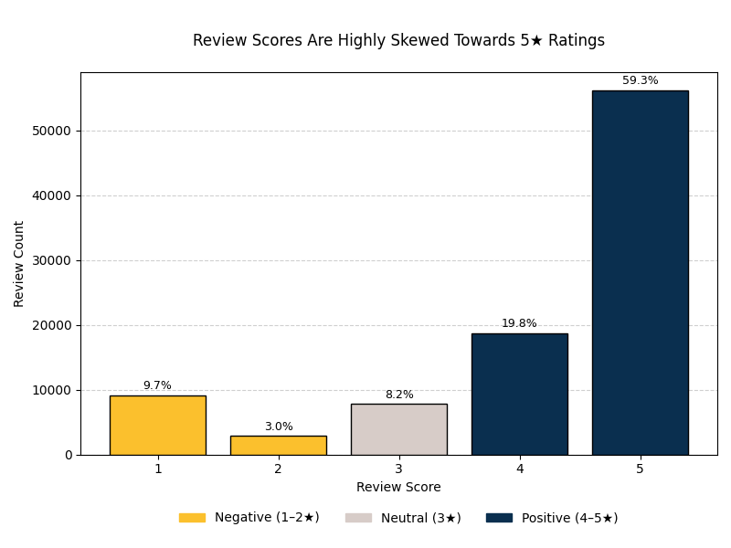
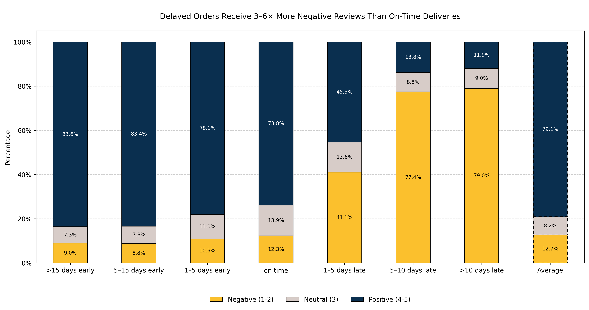
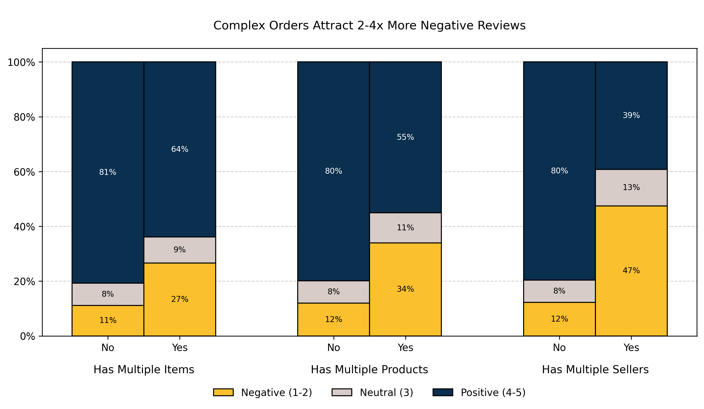
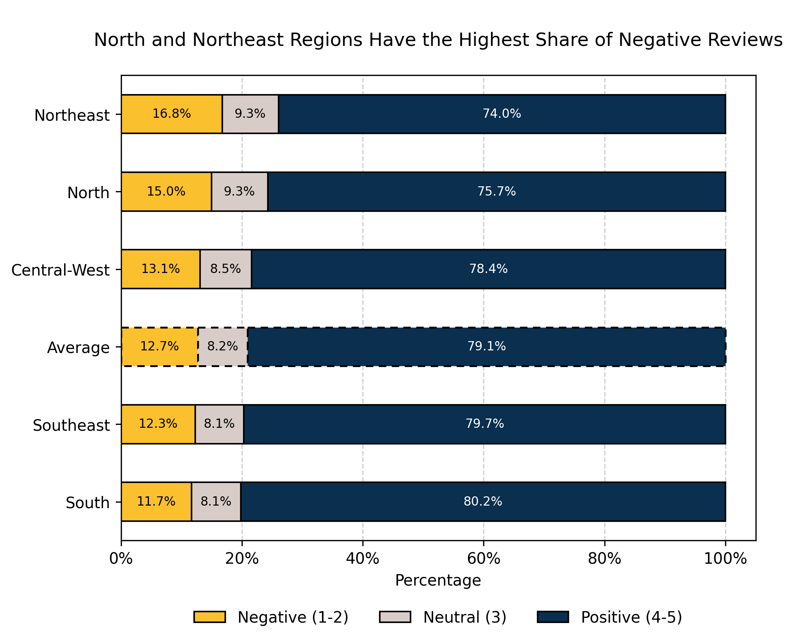
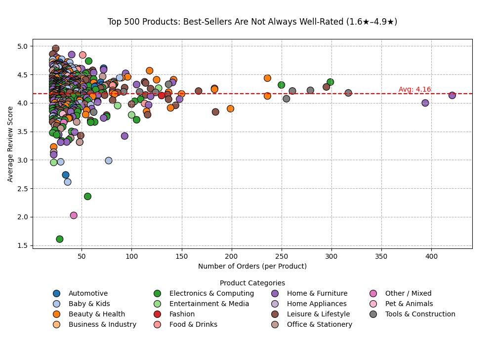

# **What Makes Customers Happy?**  
### *Data Analysis of Customer Satisfaction in Brazilian E-Commerce*


---

<a id="overview"></a>
## 🔹 **Overview**

This project investigates **key factors driving customer satisfaction** in online retail, using a large Brazilian e-commerce dataset. By analyzing order-level data enriched with product, seller, and customer information, the project uncovers **patterns behind positive and negative reviews** and translates them into **actionable recommendations** for both platforms and sellers.

---

<a id="highlights"></a>
## 🔹 **Project Highlights**

- **~100K e-commerce orders** from Brazil analyzed across 8 relational tables  
- **Comprehensive pipeline**: cleaning → integration → feature engineering → insights  
- **Custom feature engineering** across orders, products, sellers, customers, and shipping  
- **Advanced EDA** with custom Python visualization functions  
- **Reusable utilities**: developed a `utils.py` module to streamline data inspection, geospatial mapping, and advanced review score visualizations  
- **Geospatial insights**: regional differences in customer satisfaction  
- **Actionable business recommendations** for both platform and sellers  
- **Ready for extension**: predictive modeling, sentiment analysis, and seller segmentation

---
<a id="contents"></a>
## 🔹 **Table of Contents**

- [Overview](#overview)
- [Project Highlights](#highlights)
- [Context & Motivation](#context)
- [Research Questions](#questions)
- [Dataset](#dataset)
- [Project Structure](#structure)
- [Review Score Distribution](#distribution)
- [Methodology](#methodology)
- [Key Insights](#insights)
- [Visualizations](#visuals)
- [How to Use](#usage)
- [Conclusions & Recommendations](#recommendations)
  - [For the Platform](#platform)
  - [For Sellers](#sellers)
- [Limitations & Next Steps](#limitations)
  - [Future Work](#future)
- [About Me](#about)

---

<a id="context"></a>
## 🔹 **Context & Motivation**

> “If you make customers unhappy in the physical world, they might each tell 6 friends. If you make customers unhappy on the internet, they can each tell 6,000.” 
> — *Jeff Bezos*

Customer satisfaction is a **critical success factor** in e-commerce:  
- Positive experiences boost retention, repeat purchases, and recommendations.  
- Negative experiences lead to **poor online reviews** and **brand damage**.

**Project goal:**  
**What drives customer satisfaction in online retail, and how can businesses use this knowledge to improve their service?**

---

<a id="questions"></a>
## 🔹 **Research Questions**

This analysis is guided by the following questions:

- Do customers react sensitively to late deliveries?  
- Are larger, more complex orders evaluated less favorably?  
- Are there regional patterns in customer satisfaction?   
- Are some product categories rated better than others?   
- Do price, weight, or shipping costs influence ratings?  
- Do payment methods or installment counts matter? 

---

<a id="dataset"></a>
## 🔹 **Dataset**

- **Source:** [Brazilian E-Commerce Public Dataset by Olist](https://www.kaggle.com/datasets/olistbr/brazilian-ecommerce)  
- **Content:** 8 relational tables covering orders, order items, customers, products, sellers, reviews, payments, and geolocation data.  
- **Key Characteristics:**  
  - ~100K orders with reviews recorded **per order** (not per product).  
  - Requires aggregation of product-level features to the order level.  
  - Rich information on sellers, customer locations, delivery times, and payment details.

---

<a id="structure"></a>
## 🔹 **Project Structure**

```
project/
│── data/
│   ├── raw/         # Original datasets
│   ├── cleaned/     # Cleaned tables
│   ├── joined/      # Order-level merged dataset
│   ├── final/       # Final dataset used for analysis
│   └── geo/         # Brazilian geojson file for map visualizations
│
│── images/          # Plots, ER diagram, and visuals for README
│
│── notebooks/
│   ├── 01_data_cleaning.ipynb
│   ├── 02_data_integration_preprocessing.ipynb
│   ├── 03_feature_engineering.ipynb
│   └── 04_customer_satisfaction_analysis.ipynb
│
│── utils.py         # Helper functions for EDA & visualization
│── README.md
```

**Tech Stack:** `Python` • `pandas` • `DuckDB` • `matplotlib` • `seaborn` • `GeoPandas`

---

<a id="distribution"></a>
## 🔹 **Review Score Distribution**



*Baseline distribution: the J-shaped distribution reveals that customers mostly leave either very positive or very negative feedback, resulting in a high average score of 4.2*

---

<a id="methodology"></a>
## 🔹 **Methodology**

1. **Data Cleaning** – handled duplicates, missing values, standardized columns  
2. **Data Integration** – joined 8 relational tables into an **order-level dataset**  
3. **Feature Engineering** – created features for orders, products, sellers, customers, and shipping  
4. **Exploratory Data Analysis (EDA)** – visualized patterns in review scores using custom plotting functions  

---

<a id="insights"></a>
## 🔹 **Key Insights**

- **Delivery Delays** → strongest negative driver:  
  - Ratings drop from **4.3★ to 2.3★** with delays; >60% of delayed orders get **1–2★**.  
- **Order Complexity** reduces satisfaction:  
  - Multi-seller orders → **2.8★** (~50% negative); multi-product orders also lower ratings.  
- **Product Popularity ≠ Quality**:  
  - Top 500 bestsellers range from **1.6★ to 4.9★**.  
- **Regional Differences**:  
  - Northeast customers rate lower (<4.0★); South/Southeast sellers perform best (~4.4★).  
- **Minimal Impact** from shipping cost, payment method, and detailed product pages.

---

<a id="visuals"></a>
## 🔹 **Visualizations**

### **1. Delivery Delays Impact**
   

   *Even minor delays (1–5 days) cause a sharp increase in 1–2★ reviews (41%), while deliveries arriving early do not significantly improve ratings compared to the average.*

### **2. Order Complexity Impact**
     
   
   *Negative reviews increase with order complexity, likely due to delivery delays and fragmented experiences when items ship from multiple sellers.*

### **3. Regional Ratings**

   <p align="center">
    
    &nbsp;&nbsp; <!-- adds some space -->
    
  </p>

   *Lower ratings in the North and Northeast may be linked to delivery challenges and inconsistent service levels.*

### **4. Product Popularity vs Quality**
     
   *Product ratings vary widely across all categories, confirming that even popular categories have both high- and low-rated items.*

---

<a id="usage"></a>
## 🔹 **How to Use**

1. **Clone the repository:**
   ```bash
   git clone https://github.com/OlesyaEvseeva/customer-satisfaction-ecommerce.git
   cd customer-satisfaction-ecommerce
   ```
2. **Set up the environment**:
   ```bash
   uv sync    # or poetry install
   ```
3. **Run the notebooks** in order from the `notebooks` folder.
   
[🠉 Back to top](#contents)

---

<a id="recommendations"></a>
## 🔹 **Conclusions & Recommendations**

<a id="platform"></a>
### For the Platform:
- Optimize delivery times (set SLAs, improve logistics)  
- Simplify cross-seller orders  
- Act on poor-performing products  
- Address regional disparities in service  

<a id="sellers"></a>
### For Sellers:
- Prioritize punctual shipping  
- Focus on product quality improvements  
- Worry less about price, focus on service quality  
- Learn from practices of high-performing regions  

---

<a id="limitations"></a>
## 🔹 **Limitations & Next Steps**

- Used **state-level proxies** instead of exact distances  
- Did not analyze review text (~60% missing) → sentiment analysis could help  
- Ratings at **order level** limited product-level insights
- Dataset contains **very few repeated customers** (~5%), limiting insights into customer loyalty and long-term behavior patterns 

<a id="future"></a>
### Future Work
- Build a **predictive model** to quantify impact of factors  
- Perform **sentiment analysis** on review comments  
- Explore **segmentation** for sellers to identify behavior patterns

---

<a id="about"></a>
## 🔹 **About Me**

I’m Olesya, a data analyst with 10 years of experience making sense of complex data and turning it into insights that help businesses make better decisions.  
I’m curious by nature and enjoy working on different kinds of analytical problems, finding patterns, and coming up with solutions that make a real difference.

[Connect with me on LinkedIn](https://www.linkedin.com/in/olesya-evseeva/)

[🠉 Back to top](#contents)
